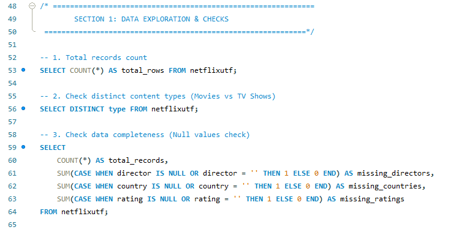
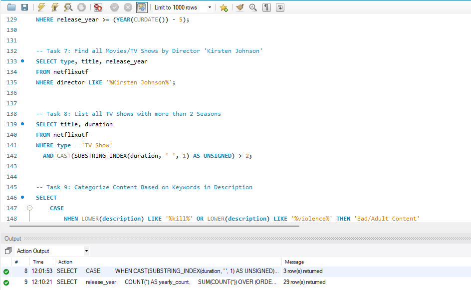
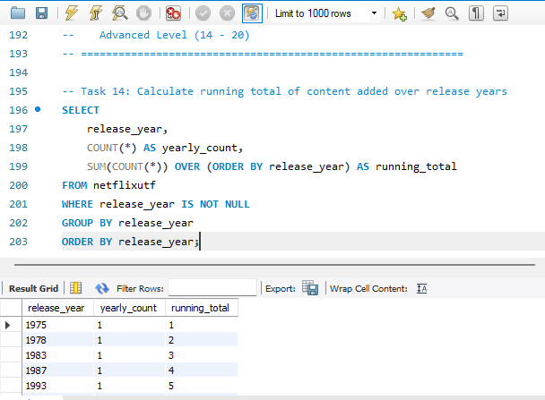
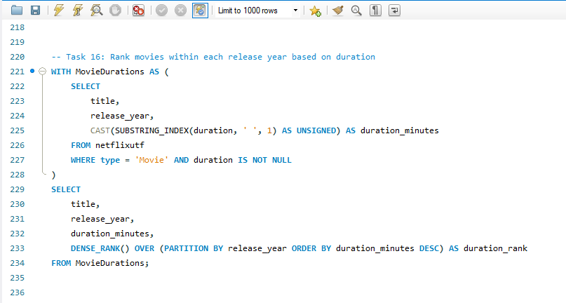
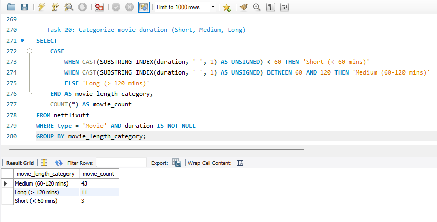

# Netflix Data Analysis & Insights

## 📊 Project Overview

*Netflix Data Analysis & Insights* is a MySQL-based SQL analytics project designed to analyze and explore Netflix's content catalog.

The project uses a Netflix dataset containing information about *Movies, TV Shows, directors, cast, countries, ratings, genres, release years, durations, and descriptions*. SQL is used to analyze content distribution, rating patterns, country-wise production, genre trends, director and actor contributions, release-year trends, and movie duration.

The primary objective of this project is to demonstrate how SQL can transform raw content data into meaningful insights that support *data-driven analysis and better understanding of Netflix's content trends*.

---

## 🎯 Project Objectives

The project focuses on analyzing:

* 🎬 Movie & TV Show Distribution
* ⭐ Content Rating Analysis
* 🌍 Country-wise Content Analysis
* 🎭 Director & Actor Analysis
* 🎞️ Genre Analysis
* 📅 Release Year & Content Trends
* ⏱️ Movie Duration Analysis
* 🌎 Single & Multi-Country Productions
* 📊 Content Distribution & Performance Insights

---

## 🗄️ Database

*Database:* netflix_db  
*SQL Tool:* MySQL Workbench  
*Table:* netflixutf  
*Database Engine:* MySQL

The project begins by creating and selecting the MySQL database:

```sql
CREATE DATABASE netflix_db;

USE netflix_db;

---

| Column       | Description                       |
| ------------ | --------------------------------- |
| show_id      | Unique identifier for each title  |
| type         | Movie or TV Show                  |
| title        | Name of the content               |
| director     | Director information              |
| cast         | Cast information                  |
| country      | Country of production             |
| rating       | Content rating                    |
| release_year | Year of release                   |
| duration     | Movie duration or TV Show seasons |
| listed_in    | Genre / category                  |
| description  | Content description               |

---

| # | Business Question                                       | SQL Concepts               |
| - | ------------------------------------------------------- | -------------------------- |
| 1 | How many Movies and TV Shows are available?             | GROUP BY, COUNT()          |
| 2 | What is the most common rating for Movies and TV Shows? | CTE, RANK(), GROUP BY      |
| 3 | Which Movies were released in a specific year?          | WHERE, AND                 |
| 4 | Which are the top 5 countries with the most content?    | GROUP BY, ORDER BY, LIMIT  |
| 5 | What is the longest Movie available?                    | ORDER BY, String Functions |

---

| #  | Business Question                                          | SQL Concepts                     |
| -- | ---------------------------------------------------------- | -------------------------------- |
| 6  | What content was released within the last 5 years?         | WHERE, Date Functions            |
| 7  | Which Movies/TV Shows were directed by Kirsten Johnson?    | LIKE, WHERE                      |
| 8  | Which TV Shows have more than 2 seasons?                   | String Functions, WHERE          |
| 9  | How can content be categorized using description keywords? | CASE, LIKE                       |
| 10 | Which directors have worked on both Movies and TV Shows?   | GROUP BY, HAVING                 |
| 11 | Which Movies are Documentaries?                            | LIKE, WHERE                      |
| 12 | How many titles were released each year after 2015?        | GROUP BY, ORDER BY               |
| 13 | What are the top 3 genres by number of titles?             | JOIN, String Functions, GROUP BY |

---

| #  | Business Question                                                   | SQL Concepts                     |
| -- | ------------------------------------------------------------------- | -------------------------------- |
| 14 | What is the running total of content across release years?          | Window Function                  |
| 15 | Which actor has appeared in the most content?                       | JOIN, String Functions, GROUP BY |
| 16 | How are Movies ranked within each release year based on duration?   | CTE, DENSE_RANK()                |
| 17 | What percentage of content consists of Movies vs TV Shows?          | Subquery, Aggregation            |
| 18 | How can single-country and multi-country productions be identified? | CASE, GROUP BY                   |
| 19 | What is the average Movie duration for each rating category?        | AVG(), GROUP BY                  |
| 20 | How can Movies be categorized by duration?                          | CASE, GROUP BY                   |


---

🧠 SQL Concepts Used

This project demonstrates practical use of:

SELECT
WHERE
GROUP BY
HAVING
ORDER BY
LIMIT
DISTINCT
COUNT()
SUM()
AVG()
ROUND()
RANK()
DENSE_RANK()
Window Functions
Common Table Expressions (CTEs)
Subqueries
CASE Statements
LIKE
String Functions
NULL Handling
Conditional Analysis
Percentage Calculations
Data Categorization

The analysis progresses from basic SQL queries to advanced analytical techniques using CTEs, subqueries, ranking functions and window functions.

## 📊 Key Project Insights
---

## 📸 Query Results & Analysis Screenshots

The following screenshots highlight key SQL queries, analysis, and results from the Netflix Data Analysis project.

### 🔎 1. Data Exploration & Data Quality

Initial exploration of the Netflix dataset, including total records, content types, and missing-value checks.



---

### ⏱️ 2. Movie Director Analysis

Movies are categorized into three duration categories using SQL `CASE` statements:

- Short — Less than 60 minutes
- Medium — 60–120 minutes
- Long — More than 120 minutes



---

### 📈 3. Running Total Analysis

A SQL window function is used to calculate the cumulative number of Netflix titles across different release years.



---

### 🏆 4. Movie Ranking by Release Year

A Common Table Expression (CTE) and `DENSE_RANK()` are used to rank movies within each release year based on their duration.



---

### 💻 5. Categorize_movie_duration

Example of SQL analysis using filtering, string functions, conditional logic, and content categorization.



---

## 💡 Project Insights

### 🎬 Content Distribution

The project provides a comparison between Movies and TV Shows to understand the overall distribution of Netflix content.

### ⭐ Rating Analysis

Rating analysis identifies the most frequently occurring content ratings across Movies and TV Shows.

### 🌍 Country Analysis

Country-wise analysis identifies the countries contributing the highest number of Netflix titles.

### 🎞️ Genre Analysis

Genre analysis identifies frequently occurring content categories and provides an overview of Netflix's content catalog.

### 🎭 Director & Actor Analysis

The project identifies directors who have contributed to both Movies and TV Shows and analyzes actor appearances across the dataset.

### 📅 Release Year Trends

Release-year analysis helps identify how Netflix content is distributed across different years and calculates cumulative content using window functions.

### ⏱️ Movie Duration

Movie duration analysis categorizes Movies into Short, Medium, and Long categories and compares duration patterns across rating categories.

### 🌎 Production Analysis

The project distinguishes between:

Single-Country Production
Multi-Country Co-production
Unknown Production Information


## 🔄 Project Workflow
DATASET
   ↓
DATABASE
   ↓
DATA EXPLORATION
   ↓
DATA QUALITY CHECKS
   ↓
SQL BUSINESS QUESTIONS
   ↓
SQL QUERIES
   ↓
QUERY RESULTS
   ↓
DATA ANALYSIS
   ↓
PROJECT INSIGHTS


## 🏗️ Analysis Framework
Movies & TV Shows
        ↓
Content Distribution & Ratings

Countries
        ↓
Country-wise Content Analysis

Genres
        ↓
Genre & Category Analysis

Directors & Actors
        ↓
People & Content Contribution

Release Years
        ↓
Content Trends & Running Totals

Movie Duration
        ↓
Duration & Rating Analysis

        ↓

Advanced SQL Analysis
CTEs • Subqueries • CASE
RANK • DENSE_RANK • Window Functions

## 📂 Project Structure
Netflix-Data-Analysis-SQL/
│
├── README.md
│
├── Netflix Data Analysis & Insights Analytics - SQL Project.sql
│
└── screenshots/
    ├── data-exploration.png
    ├── movie-duration-analysis.png
    ├── running-total-analysis.png
    ├── movie-ranking.png
    └── sql-query-analysis.png

## 🛠️ Tools & Technologies
MySQL
SQL
MySQL Workbench
Data Analysis
Data Exploration
Business Analytics
GitHub


## 📌 Project Highlights

This project demonstrates practical experience with:

Netflix content data analysis
Data exploration and quality checks
Movie and TV Show analysis
Rating and genre analysis
Country-wise analysis
Director and actor analysis
Release-year trend analysis
Movie duration analysis
Advanced SQL queries
CTEs and subqueries
Window functions
Ranking functions
String manipulation
Data-driven insights


## 🏁 Conclusion

The Netflix Data Analysis & Insights project demonstrates how SQL can transform raw Netflix content data into meaningful analytical insights.

By analyzing Movies, TV Shows, ratings, countries, genres, directors, actors, release years, and durations, the project provides a structured view of Netflix's content catalog and its major trends.

Through SQL techniques such as GROUP BY, HAVING, aggregate functions, CTEs, subqueries, CASE statements, ranking functions, and window functions, the project answers a wide range of analytical questions.

Overall, this project demonstrates practical skills in SQL, data analysis, data interpretation, advanced querying, and analytical problem-solving.

## 👨‍💻 Author

Riya Pareek

Aspiring Data Analyst | SQL | Excel | Python | Data Analytics

⭐ If you find this project useful, consider giving the repository a star.
